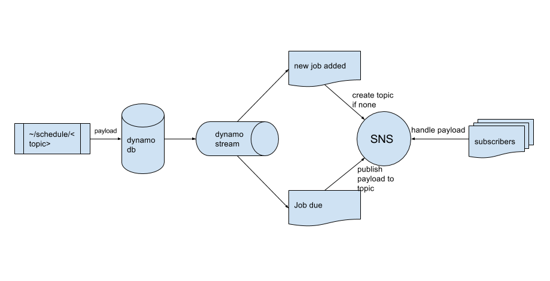

# sns-boomerang

sns-boomerang schedules sns in a serverless fashion.

# SETUP

## dependency:

before you start  
`pip install tox`  
run command (install dev dependency)  
`tox -e dev`  
activate virtual env  
`source .tox/dev/bin/activate`  
install dependency  
`pip install -r requirements.txt`

# RUN CODE

`python app.py`

# TEST

`tox -e test -- --cov=sns_boomerang tests --cov-report=html`

# SWAGGER

`http://127.0.0.1:5000/doc`

# Deploy

`zappa deploy`  
more on zappa checkout: https://github.com/Miserlou/Zappa

# Reference

https://docs.aws.amazon.com/amazondynamodb/latest/APIReference/API_Operations_Amazon_DynamoDB_Streams.html  
https://aws.amazon.com/sns/  
https://aws.amazon.com/sqs/  
https://aws.amazon.com/lambda/
